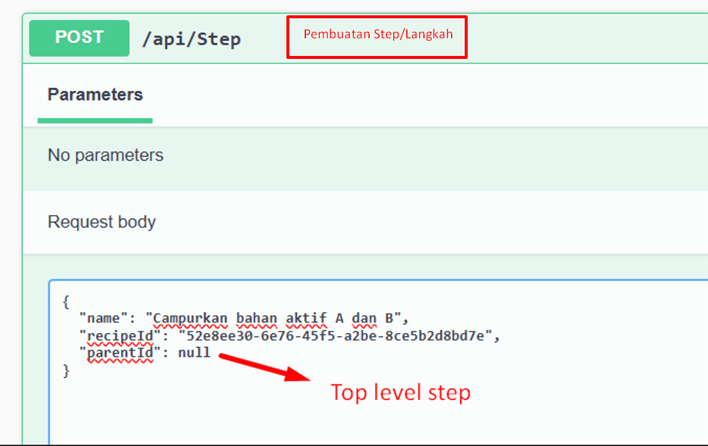

# Recipe Management API

# Cara instalasi

clone repository  
git clone https://github.com/ArkanFauzan/Backend-Recipe.git

jalankan command  
cd Backend-Recipe

jalankan command  
dotnet restore

buat appsettings.json dan sesuaikan connection dan secret key. Strukturnya dapat dilihat dari _appsettings.json_example

jalankan command  
dotnet ef database update

jalankan command  
dotnet run

buka http://localhost:5184/swagger/index.html

Akun login dapat menggunakan:  
Username = superadmin  
Password = 12345678

Apabila diperlukan database yang sudah ada isinya, lakukan import dari file sql berikut:   
https://github.com/ArkanFauzan/Backend-Recipe/blob/main/recipe_db.sql

# ERD

# Penjelasan ERD
- Table DataTypes
  - Berfungsi untuk CRUD Tipe Data
  - Terdapat beberapa jenis validasi data, seperti integer, float, dan custom regex
  - Custom regex dapat digunakan apabila diperlukan data dengan kriteria tertentu, misalnya angka dari 1-100
  - Contoh pengisian data:
    - Name            || ParseType    || CustomRegex
    - Integer         || INTEGER      || ""
    - Float           || FLOAT        || ""
    - Integer (1-100) || CUSTOM_REGEX || "^(100|[1-9][0-9]?$)"
- Table StepParameterTemplates
  - Berfungsi sebagai parameter template
  - Parameter seperti deskripsi, suhu, tekanan, bisa terdapat di banyak step/langkah
  - Dapat memudahkan pengisian step parameter
  - Contoh pengisian data:
    - Name            || DataTypeId    || Description
    - Suhu            || uuid Float    || "Suhu yang digunakan"
    - Tekanan         || uuid Float    || "Tekanan alat yang digunakan"
    - Durasi          || uuid Integer  || "Lama waktu pelaksanaan langkah"
- Table StepParameters
  - Berfungsi sebagai parameter dari suatu step/langkah
  - Kolom Value berisi nilai dari parameter tersebut
  - Kolom Note dapat berisi keterangan/unit/satuan dari Value (karena pada StepParameterTemplate masih deskripsi umum)
  - Contoh pengisian data:
    - StepId            || StepParameterTemplateId    || Value || Note
    - uuid step         || uuid Suhu                  || 80    || "°C"
    - uuid step         || uuid Durasi                || 30    || "Menit"
- Table Steps
  - Berisi langkah-langkah pembuatan resep, bersifat dapat memiliki unlimited sub-step
  - Kolom Depth berfungsi sebagai flag level kedalaman sub-step
  - Kolom Order (integer) berfungsi sebagai urutan langkah pada level yang setara
- Table Recipe
  - Berisi daftar recipe

- Table Permission
  - seperti "recipe"
- Table PermissionMethod
  - seperti "recipe.view", "recipe.create", "recipe.update", "recipe.delete"
- Table Role
  - seperti "Super Admin"
- Table RolePermissionMethods
  - berisi mapping antara Role dengan PermissionMethod
- Table Accounts
  - berisi data user/pengguna

# 📸 Screenshots

   
   
   
   
   
   
   
   
   
   
   
   
   
   
   
   
   
   
   

